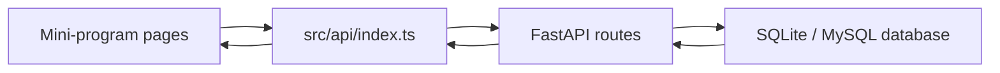

# Save Tears Team Handover Deck

Audience: UK teammates  
Format: English PPT content with speaker notes  
Recommended duration: 20-25 minutes plus 2-3 minutes live demo  
Recommended deck size: 11 slides

---

## Slide 1 - Project Overview

### Slide Title
Save Tears: Water Conservation Management System

### On-slide content
- Mini-program frontend for end users
- FastAPI backend for user and data management
- Focused on registration, login, and room-based water data lookup
- Current status: minimum working flow is complete

### Speaker notes
Save Tears is a water conservation management system that combines a uni-app mini-program frontend with a FastAPI backend. The project already supports a complete basic user flow: user registration, user login, local user persistence, and room-based lookup for water flow, sewage turbidity, and water bill data. This meeting is meant to help the team understand the current implementation and take over development efficiently.

### Visual suggestion
- Use the product name and one short tagline.
- Add a simple split visual: mini-program on the left, backend on the right.

---

## Slide 2 - Purpose Of This Meeting

### Slide Title
Purpose Of This Handover

### On-slide content
- Clarify what is already working
- Separate production logic from UI prototypes
- Show how the codebase is structured
- Propose a practical team split for the next phase

### Speaker notes
This is a handover and onboarding session rather than a final defense presentation. I want to make four things clear: what is already working end to end, what is still only a prototype or placeholder, where the most important code entry points are, and how we can divide the next stage of work across the team.

### Visual suggestion
- A simple four-box layout with the four points above.

---

## Slide 3 - System Architecture

### Slide Title
Current System Architecture

### On-slide content

- Frontend: `save_tears_miniprogram`
- API bridge: `save_tears_miniprogram/src/api/index.ts`
- Backend: `save_tears_backend/api.py`
- DB bootstrapping: `save_tears_backend/main.py`

### Speaker notes
The architecture is intentionally simple. User actions happen inside the mini-program pages. Those pages do not call raw URLs directly; they go through a shared request layer in `src/api/index.ts`. That file sends requests to the FastAPI backend. The backend reads and writes data through SQLAlchemy models and returns JSON responses. The current database is SQLite by default, but the backend also supports switching to MySQL through `SAVE_TEARS_DB_URL`.

### Visual suggestion
- Keep the diagram simple and linear.
- Add one subtitle under the diagram: "Page interaction -> API wrapper -> backend route -> database -> JSON response -> page rendering".

---

## Slide 4 - What Is Already Working

### Slide Title
Completed End-To-End Flow

### On-slide content
1. User registration
2. User login
3. Local storage of user information
4. Room-based lookup for:
   - water flow
   - sewage turbidity
   - water bill

### Speaker notes
The most important point is that a true end-to-end flow already exists. A user can register, then log in, and the frontend stores the returned user object locally. That object includes the room number. The three data pages then read the room number from local storage and request the relevant records from the backend. So this part is not just mock UI; it is connected to real backend routes and real database data.

### Visual suggestion
- Use a horizontal flow diagram from Register to Login to Local Storage to Three Data Pages.

---

## Slide 5 - Frontend Status By Page

### Slide Title
Frontend Status By Page

### On-slide content
**Working business pages**
- `login`
- `register`
- `water-flow`
- `sewage-turbidity`
- `water-bill`

**Partially dynamic pages**
- `home`
- `profile`

**Prototype / mock page**
- `admin`

### Speaker notes
The frontend is currently in three states. The first group is truly functional and API-driven. The second group is visually complete enough to show direction, but only some parts are dynamic. For example, the home page and profile page can display the logged-in username, but most content is still static or placeholder content. The admin page is currently a UI prototype with mock data and interaction feedback, not a real management console.

### Visual suggestion
- Three columns with color coding: green for working, amber for partial, grey for prototype.

---

## Slide 6 - Backend APIs And Shared Interfaces

### Slide Title
Main Backend Interfaces

### On-slide content
**Used by the mini-program now**
- `POST /register`
- `POST /login`
- `GET /water_flow/{room_number}`
- `GET /sewage_turbidity/{room_number}`
- `GET /water_bill/{room_number}`

**Already implemented but not connected in UI**
- `POST /water_flow`
- `POST /sewage_turbidity`
- `POST /water_bill`
- `GET /users`

### Speaker notes
These are the main interfaces teammates need to know. The first group is already used in the mini-program and supports the existing business flow. The second group already exists in the backend and in the frontend API wrapper, but there are no frontend pages connected to those submit routes yet. That means future work can focus on building the pages and forms rather than starting from zero on the API side.

### Visual suggestion
- Two blocks: "Connected" and "Ready but unused".

---

## Slide 7 - How To Read The Codebase Quickly

### Slide Title
Fastest Way To Understand The Codebase

### On-slide content
- `save_tears_miniprogram/src/pages.json`
  - routes, page list, tab bar
- `save_tears_miniprogram/src/api/index.ts`
  - request wrapper and API functions
- `save_tears_backend/api.py`
  - models, schemas, routes, database queries

### Speaker notes
If someone new joins the project, these are the three best files to start with. `pages.json` shows the whole mini-program page map. `src/api/index.ts` explains how requests are sent and which API functions exist. `save_tears_backend/api.py` shows the real backend logic, data models, and route behavior. Starting with these three files is the quickest way to build a mental model of the project.

### Visual suggestion
- Use a "Start here" ladder or three stacked cards.

---

## Slide 8 - Current Gaps And Risks

### Slide Title
Current Gaps And Risks

### On-slide content
- Home page content is mostly static
- Profile feature buttons are not connected
- Admin page uses mock data only
- Registration UI collects email, but backend does not store it
- Auth is local-storage based, not token-based
- Passwords are compared in plaintext

### Speaker notes
This is the honest status page. Some parts are complete and reusable, but there are still important gaps. The home page is mostly presentation content. The profile page has several buttons that still show a "feature under development" message. The admin page is a visual prototype. The registration page includes an email field in the UI, but the backend model does not store email yet. Authentication is currently based on local storage, and passwords are checked in plaintext, which is acceptable for local development but not for production.

### Visual suggestion
- Use a risk list with three labels: product gap, technical gap, security gap.

---

## Slide 9 - Recommended Team Split

### Slide Title
Suggested Team Ownership

### On-slide content
**Frontend feature completion**
- home page
- profile page
- admin page
- charting

**Backend and security**
- email field
- password hashing
- auth model
- API cleanup

**Data input and visualization**
- connect submit-data APIs
- add data entry forms
- build real chart pages

**Testing and integration**
- environment setup
- sample data
- regression checks
- handover docs

### Speaker notes
I recommend splitting the work by module rather than assigning isolated pages at random. One group can finish the frontend feature pages, one can focus on backend cleanup and security hardening, one can take ownership of data input and visualization, and one can manage testing, environment setup, sample data, and documentation. This structure reduces overlap and makes responsibilities clearer.

### Visual suggestion
- Four ownership blocks with one person or subgroup under each.

---

## Slide 10 - Live Demo Path

### Slide Title
Short Demo Flow

### On-slide content
1. Register a test user
2. Log in
3. Show username on the home page
4. Open the three room-based data pages
5. Confirm records are loaded from backend data

**Before the meeting**
- backend is running
- one room has sample records
- mini-program local storage is clean

### Speaker notes
The demo should stay short and safe. I would recommend showing only the flow that is already stable: registration, login, the dynamic username on the home page, and then the three room-based data pages. Before the meeting, make sure the backend is running and at least one room already has sample data, otherwise the demo may land on empty tables and look unfinished even though the request path works.

### Visual suggestion
- Show the demo path as a short numbered sequence.

---

## Slide 11 - Next Sprint Proposal

### Slide Title
Next Sprint Proposal

### On-slide content
**Stage 1**
- stabilize backend model
- add auth and security basics

**Stage 2**
- turn placeholder pages into real features
- connect data input and charting

**Stage 3**
- testing
- polish
- deployment and final presentation readiness

### Speaker notes
The next development phase can be split into three stages. First, stabilize the backend data model and security basics, especially around authentication and password handling. Second, convert the current placeholder pages into real feature pages and connect the already available submit APIs. Third, focus on testing, polish, deployment, and presentation readiness so the project is reliable as a group project rather than a solo prototype.

### Visual suggestion
- Use a 3-stage roadmap with arrows.

---

## Closing Line

Suggested final sentence:

"The project already has a solid working core. The next step is not to restart it, but to turn the working core into a more complete and team-owned system."
